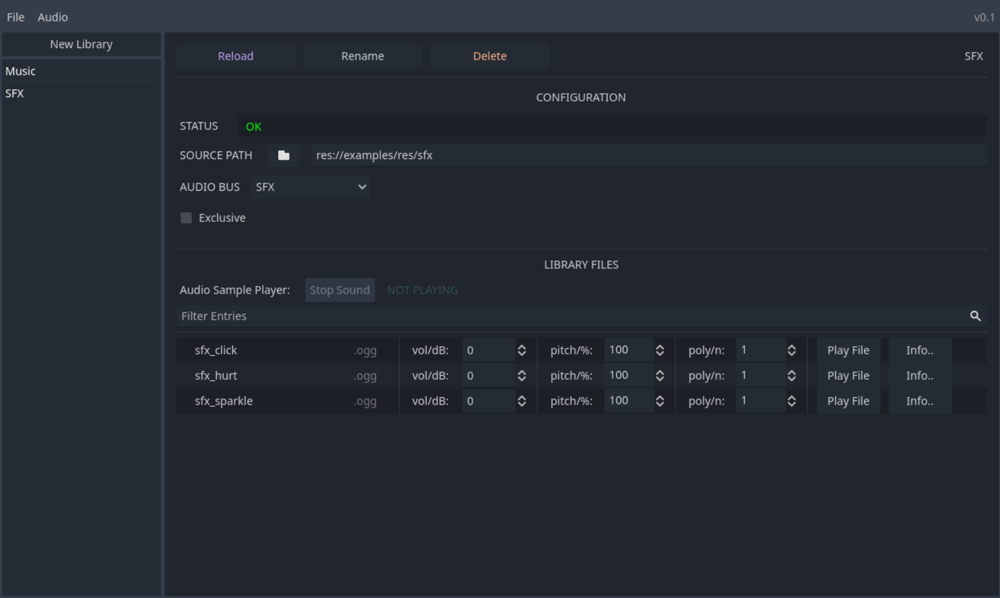

The **Audio Library Manager** is a plugin for the Godot Engine. Its purpose is to allow for quick, clean and non-destructive management of various sound files during development (such as game sound effects and soundtracks).

## Installation

The plugin can be installed by  and moving the unzipped **audio_library_manager** directory to the **addons** directory in your Godot project directory. If you don't already have an **addons** directory in your Godot project's directory root, create one there first.

## Documentation

## Screenshots

## License

Licensed under the MIT License (see `LICENSE` for more information )
