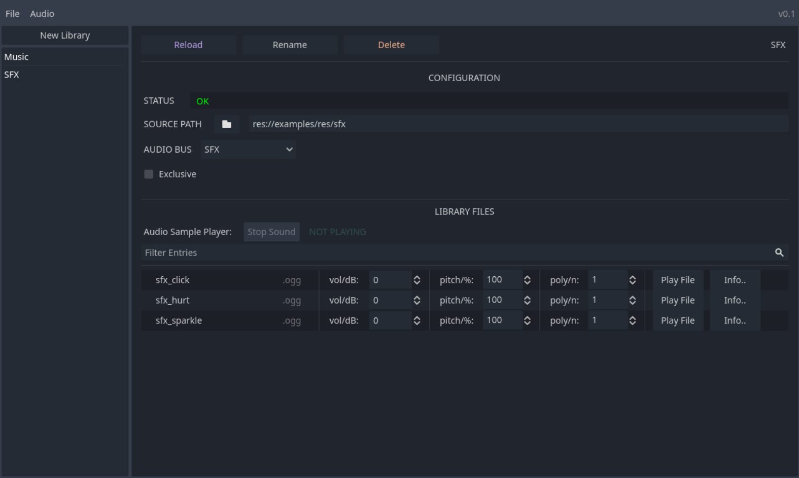

## 1. Getting Started

*Guide for plugin version 0.3*

### Initial setup

Once you have installed the plugin, you will need to activate it first. Go to **Project -> Project Settings -> Plugins** and check the **Enable** checkbox for the *Audio Library Manager* plugin.
After you have done this, a new tab should appear at the top of the editor titled **Audio**. This is where the interface for the Audio Library Manager is located.


### Interface



In the fresh interface you may now create your first audio library. Either click on the **New Library** button at the top of the item list OR Click **New Library** under the **File** tab.
You should now see the interface for your newly created, uninitialized library. The first thing to do here is to select the path to your audio files. For example, if you have some files at path `res://resources/sfx`, you can insert this path in the **Source Path** field. Alternatively, you can click the folder button next to the **Source Path** field and navigate to your preferred dictionary using the file dialog.
After entering a valid path, the plugin should now display all valid sound files at the path (and under its subdirectories). 

At this point you now have a barebones setup complete and you may mess with the library and audio file settings at your leisure (and don't worry, the files themselves will not be modified in any way). It is also recommended to rename the library to suit its purpose using the *Rename* button on the top left of the library panel. For example, if your library is meant for sound effects, you could name it "SFX". Likewise, a library meant for music could simply be named "Music" and so on.

### Playing sounds in a running project

After setting up your libraries, you will likely want to utilize the sounds in your game. To achieve this, the plugin contains an `AudioLibrary` class, which is used to play back sounds using data saved in the plugin.
To get started, use the static `initialize()` function found in `AudioLibrary` class to instantiate a new instance of the class. You can technically put this node anywhere, but I recommend putting it in an autoload. To achieve this, you could run the following in your autoload script:

`@onready var audiolibrary = AudioLibrary.initialize(self)`

This line will set up the audio library under your autoload node and return its reference to the *audiolibrary* variable.

Using this reference, we can now use the in-built functions to play global and local sounds from the libraries we set up before in the editor interface. Here are some commands available to you through the `AudioLibrary` class:

- `audiolibrary.play_sound(library_name:String, sound_name:String)`
  
Play a global sound with name `sound_name` from library `library_name`

- `audiolibrary.stop_sound(library_name:String, sound_name:String)`
  
Stop a global sound with name `sound_name` from library `library_name`

- `audiolibrary.stop_all_sounds(library_name:String)`
  
Stop global AND local (2D/3D) sounds currently playing in library `library_name`

- `audiolibrary.play_2d_sound(world:Node, target:Node, library_name:String, sound_name:String, extra_variables:Dictionary)`
  
Play a local sound in 2D space. `world` should be a root node of your world/level, `target` is the node that the sound player will follow, Plays a sound named `sound_name` from library `library_name`. `extra_variables` is a Dictionary which can be used to feed the resulting AudioStreamPlayer2D additional variables such as attenuation (Example: `{"attenuation":2.0}`)

- `audiolibrary.play_3d_sound(world:Node, target:Node, library_name:String, sound_name:String, extra_variables:Dictionary)`
  
Play a local sound in 3D space. `world` should be a root node of your world/level, `target` is the node that the sound player will follow, Plays a sound named `sound_name` from library `library_name`. `extra_variables` is a Dictionary which can be used to feed the resulting AudioStreamPlayer3D additional variables such as attenuation (Example: `{"attenuation":2.0}`)

### Example autoload script

```
extends Node

@onready var audiolibrary = AudioLibrary.initialize(self)

func play_sfx(sfx:String) -> void:
	audiolibrary.play_sound("SFX", sfx)
	
func play_2d_music(world:Node, parent:Node2D, sfx:String, properties:Dictionary) -> void:
	audiolibrary.play_2d_sound(world, parent, "Music", sfx, properties)
	
func play_3d_music(world:Node, parent:Node3D, sfx:String, properties:Dictionary) -> void:
	audiolibrary.play_3d_sound(world, parent, "Music", sfx, properties)
```

### Custom playback systems
If you would rather develop your own playback system but still utilize the data from the plugin, there are functions in place to faciliate this in the `AudioLibrary` class:

- `audiolibrary.get_data(library_name:String, sound_name:String="", strip_extension:bool=true)`
  
Returns the data of the sound `sound_name` from library `library_name`. Alternatively if `sound_name` is left blank, gets the data of library `library_name`

- `audiolibrary.data_to_audiostreamplayer(asp:Node, library_name:String, sound_name:String)`
  
Sends the data of the sound `sound_name` from library `library_name` to a given AudioStreamPlayer (normal, 2D or 3D)

If you want to go even further, you can utilize the `AudioLibraryData` class to access the data directly, however this may cause **loss of data** and is only recommended **if you know what you are doing**:

- `data_load(include_frame:bool=false, bypass_verification:bool=false, create_new_on_missing:bool=true)`
  
- `data_save(data:Dictionary, full_overwrite:bool=true, bypass_verification:bool=false)`  

By default, the audio library file (audio_library.gdal) is stored in the root of the project.


Next: 
